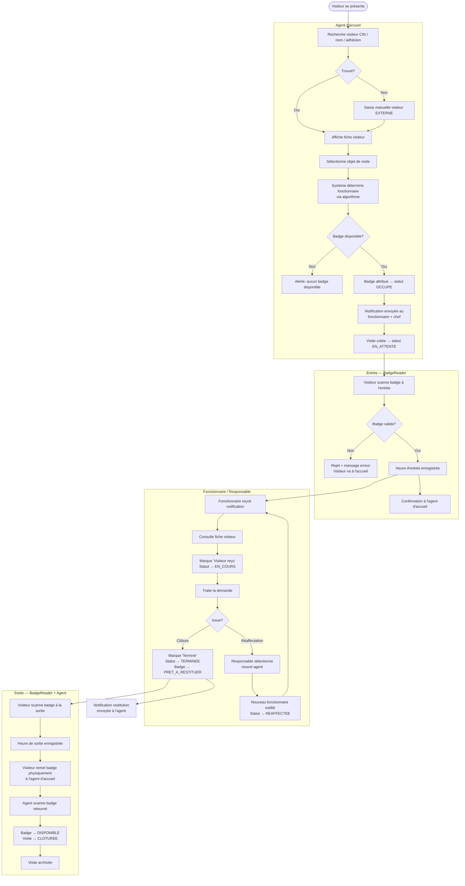
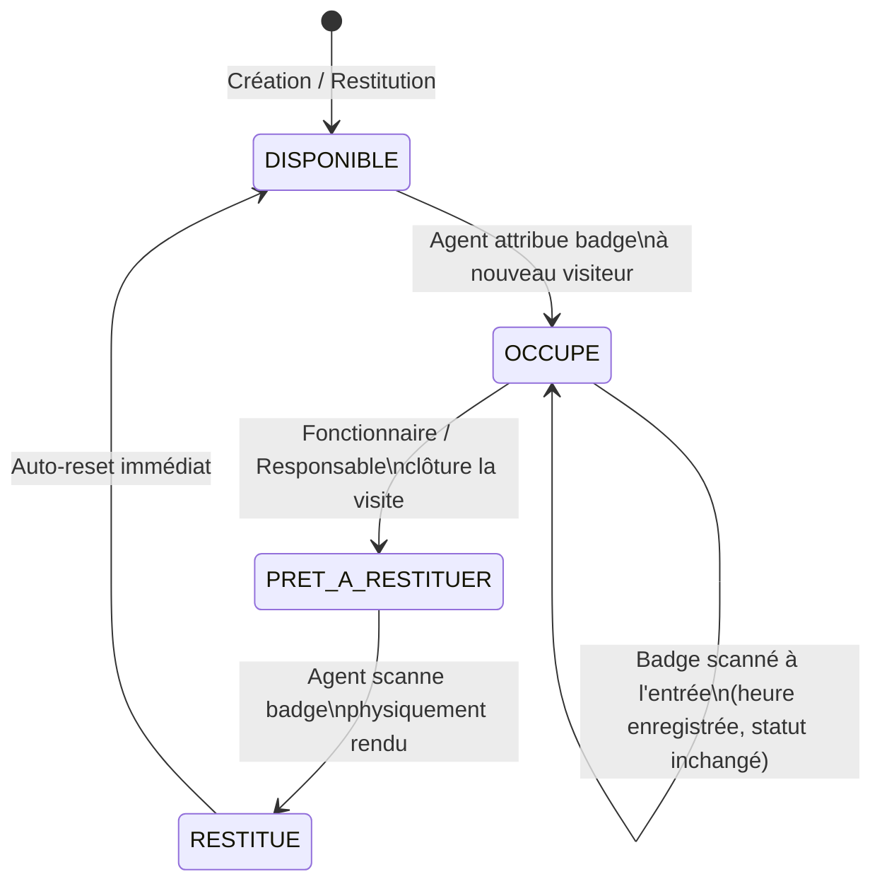
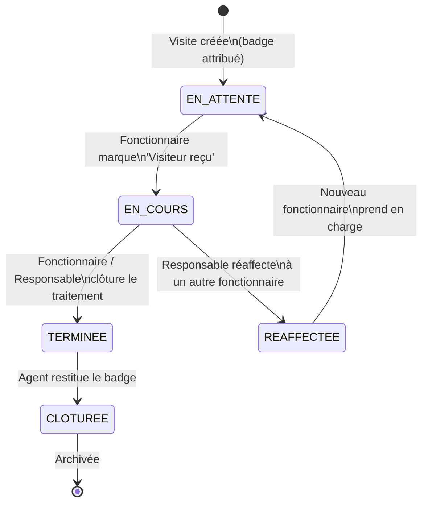
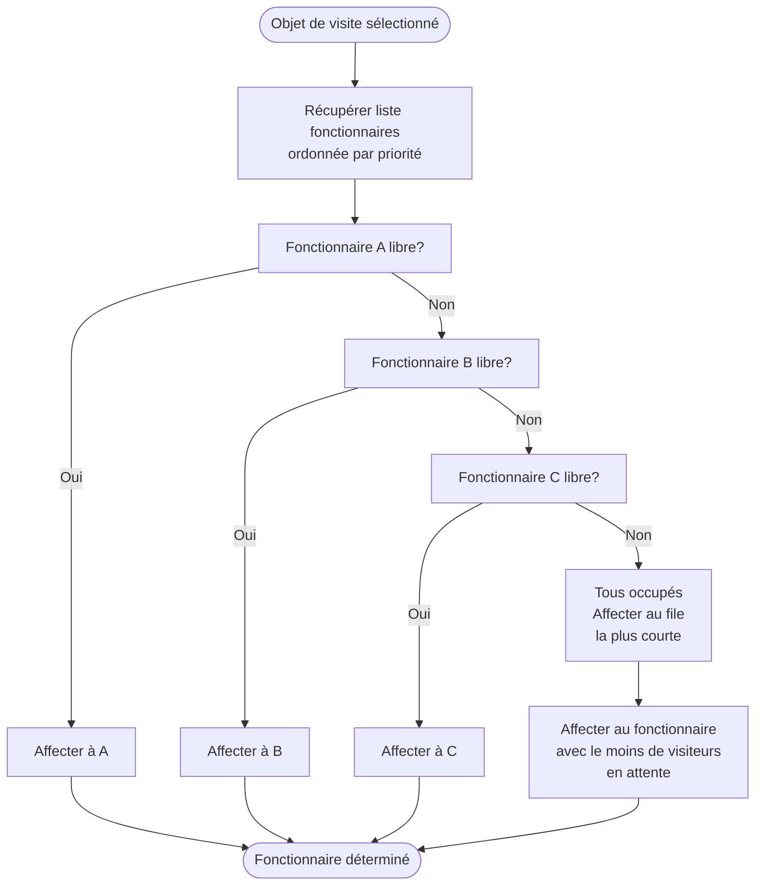
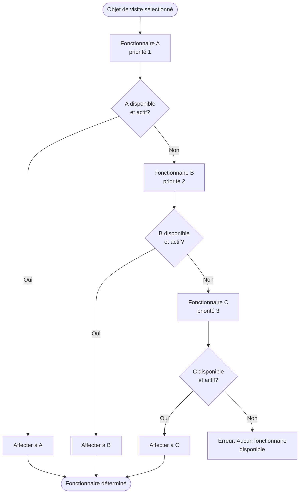
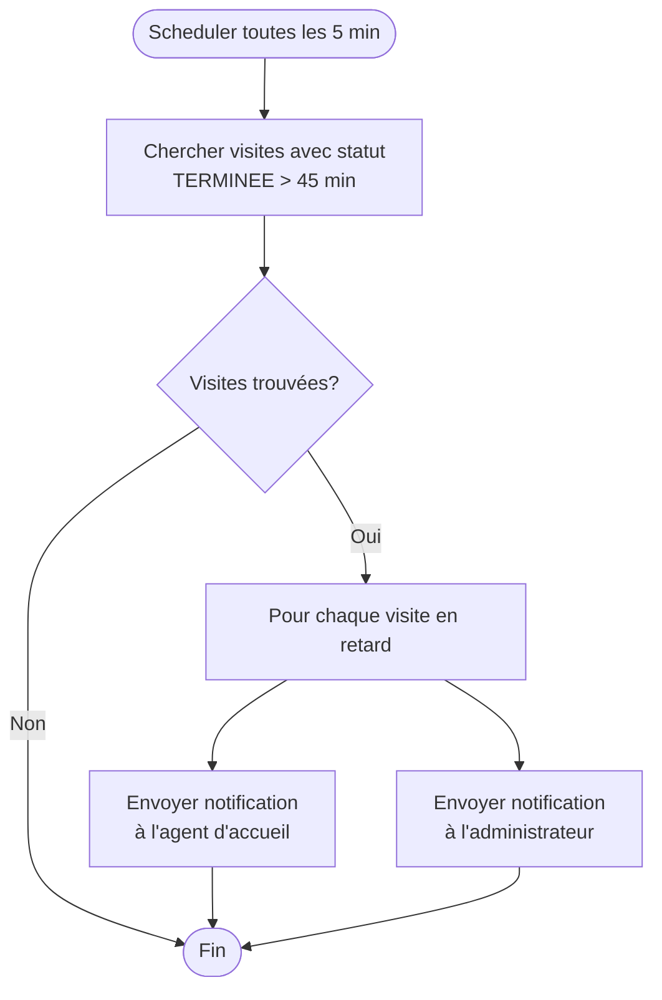
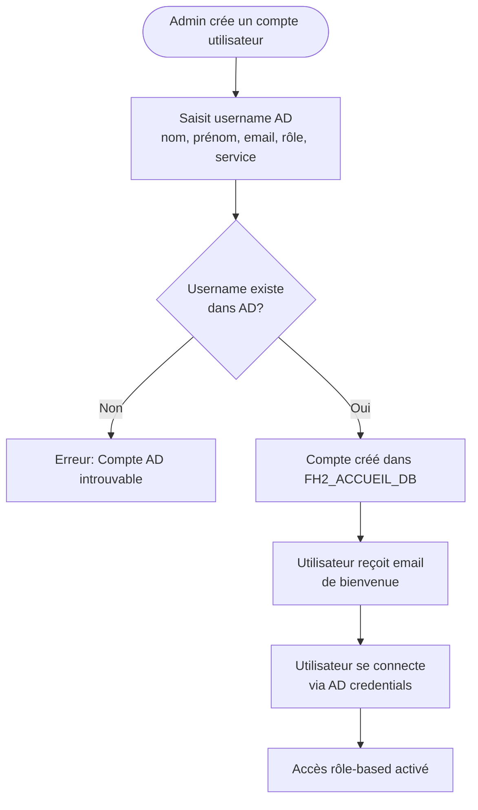
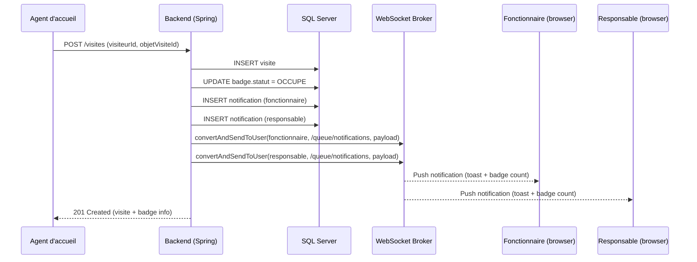
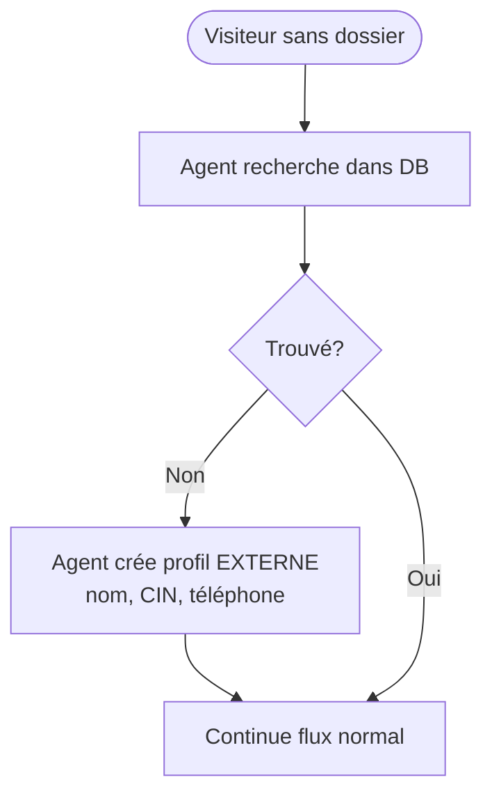
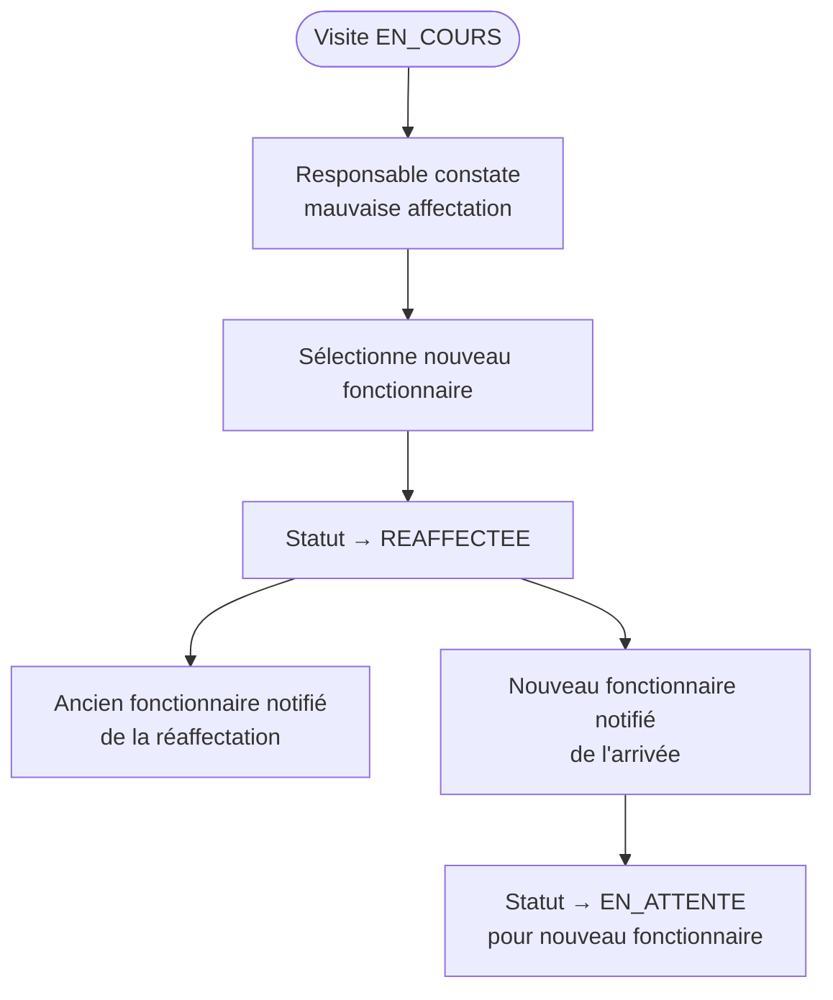

# User Flow Documentation
# Service d'Accueil — Mermaid Diagrams

---

## 1. Authentication Flow

```mermaid
flowchart TD
    A([Utilisateur ouvre l'app]) --> B[Page de connexion]
    B --> C[Saisit username + mot de passe]
    C --> D{LDAP valide?}
    D -- Non --> E[Affiche erreur 'Identifiants invalides']
    E --> B
    D -- Oui --> F{Compte actif?}
    F -- Non --> G[Affiche 'Compte désactivé']
    F -- Oui --> H[JWT émis]
    H --> I{Rôle?}
    I -- AGENT --> J[/agent Dashboard]
    I -- FONCTIONNAIRE --> K[/fonctionnaire Dashboard]
    I -- RESPONSABLE --> L[/responsable Dashboard]
    I -- ADMIN --> M[/admin Dashboard]
    I -- DIRECTEUR --> N[/directeur Dashboard]
```

---

## 2. Core Visit Lifecycle — Full Flow



---

## 3. Badge Lifecycle



---

## 4. Visit Status Lifecycle



---

## 5. Visitor Assignment Algorithm — Sequential



---

## 6. Visitor Assignment Algorithm — Priority



---

## 7. Badge Overdue Alert Flow



---

## 8. User Onboarding Flow (Admin)



---

## 9. Notification Flow (WebSocket)



---

## 10. Error Handling During User Flows

| Scenario | User-Facing Message | Recovery |
|---------|---------------------|---------|
| Badge unavailable | "Aucun badge disponible. Veuillez attendre." | Agent waits for a badge to be returned |
| Duplicate visit | "Ce visiteur a déjà une visite active." | Agent finds and closes existing visit first |
| Badge scan invalid | "Badge invalide ou déjà utilisé." | Visitor redirected to reception desk |
| LDAP connection failure | "Erreur d'authentification. Contactez l'admin." | Fallback local admin account |
| Session expired | Redirect to login page | User re-authenticates |
| Network error | Toast: "Erreur réseau. Veuillez réessayer." | Retry button shown |

---

## 11. Alternative Flows

### Guest / Walk-in Visitor (EXTERNE)


### Visit Reassignment Mid-Flow

